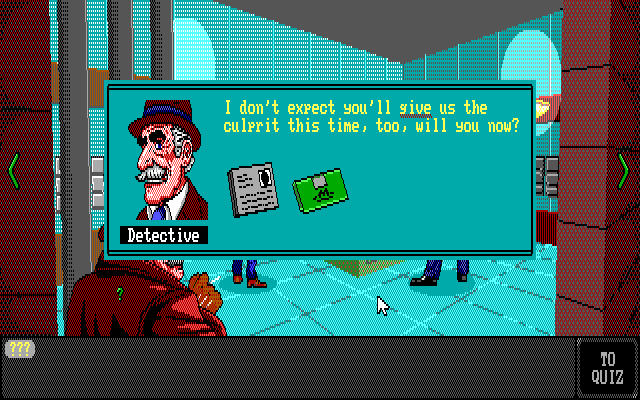

# Quid Pro Quo

A deduction mini-game for [DOSember Game Jam 2025](https://itch.io/jam/dosember-game-jam)

[Click to play in browser](https://mausimus.itch.io/quid-pro-quo)

### CREDITS
 * mausimus: coding, writing
 * joker: art, music

### HOW TO PLAY
 * you play using the mouse
 * investigate clues under question marks
 * collect words underlined in red
 * use arrows on the sides to switch locations
 * assign names you found to character portraits
 * press TO QUIZ button to enter the quiz screen
 * fill in blanks in the Quiz using words you collected
 * the Quiz will accept synonyms and alternative order

### REQUIREMENTS
 * IBM PC/AT (286) running DOS
 * 512K RAM
 * EGA graphics card (256K)
 * mouse
 * AdLib/OPL2 sound card (optional)
 * or... the default DOSBox environment

 ### HOW TO BUILD

 1. Mount as C drive in DOSBox
 2. Install Borland C++ 3.0 in C:\BORLANDC and make sure C:\BORLANDC\BIN is on PATH
 3. MAKE.BAT
 4. RUN.BAT
 
